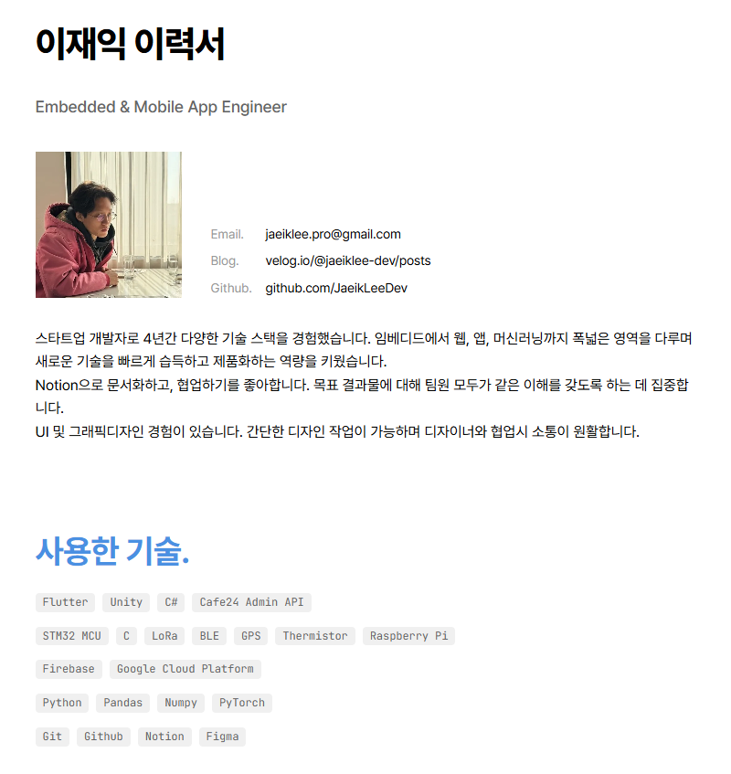
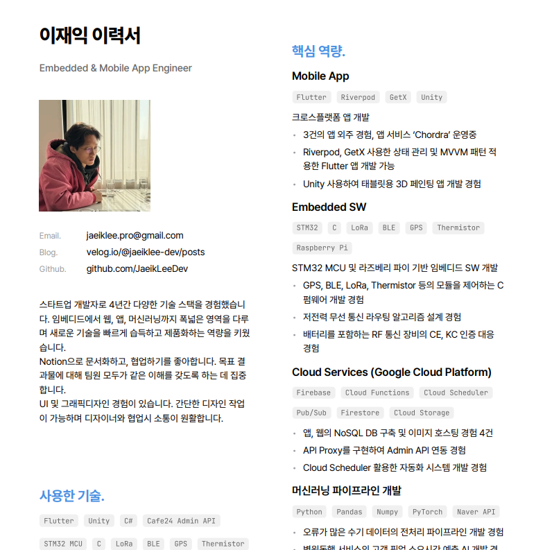

# Notion DB 연동 개발자 이력서 사이트

React와 Next.js로 구축된 공개 이력서 사이트 템플릿입니다. 연동된 Notion 데이터베이스를 수정한 후 재배포하면 이력서 페이지에 반영되도록 구현했습니다.

### Notion DB 및 이력서 사이트 예시

- [이재익 이력서 페이지](https://jaeikleedev.github.io/resume/)
- [이재익 이력서 Notion 데이터베이스](https://fluorescent-airplane-153.notion.site/Jaeik-Lee-Resume-Database-278b61feddfe80628aadf4982bcb492a)

## ✨ 주요 기능

<p align="center">
   
   
   <figcaption align="center">이력서 페이지 및 PDF 출력 결과</figcaption>
</p>

- 🔄 **Notion API 연동**: Notion에서 이력서 내용을 수정한 후 재배포하면 페이지에 반영
- 📄 **2열 포맷 PDF**: 이력서를 컴팩트한 2열 포맷으로 PDF 다운로드 가능
- 📱 **반응형 디자인**: 모바일과 데스크톱 화면 모두 최적화
- 👨‍💻 **개발자 최적화**: 기술 스택, 포트폴리오 등 개발자 이력에 최적화된 구성
- 👁️ **show/hide**: 원하는 섹션/프로퍼티만 show/hide 할 수 있는 기능

## 🛠 기술 스택

- **Frontend**: Next.js 15, React 19, TypeScript
- **Styling**: Tailwind CSS, Custom CSS Variables
- **Fonts**: Pretendard (주요 폰트), JetBrains Mono (코드/기술 스택)
- **API Integration**: Notion API (@notionhq/client)
- **PDF Generation**: Puppeteer + @sparticuz/chromium
- **Deployment**: Vercel + GitHub Pages

## 📋 이력서 섹션 구성

모든 섹션을 Notion DB로 관리합니다. DB가 비어있으면 해당 섹션은 숨겨집니다.

1. 개인 정보
2. 사용한 기술
3. 핵심 역량
4. 업무 경험
5. 프로젝트 경험
6. 포트폴리오
7. 수상
8. 활동
9. 기타 경험
10. 가치관
11. 개발 외 툴 활용 역량
12. 학력
13. 자격증 및 어학
14. 병역

## ✅ 코딩 한 줄 없이 모든 기능을 사용할 수 있습니다!

### "공개 이력서 페이지만 있으면 돼!"

1. Notion Database 생성
2. Notion과 GitHub Integration
3. GitHub Actions 실행하여 배포

### "이력서 PDF로 출력하고 싶어!"

공개 이력서 페이지 배포 후 추가로 아래 작업 수행

1. Notion과 Vercel 연동
2. GitHub repo와 Vercel 연동
3. GitHub Actions secret에 `NEXT_PUBLIC_PDF_URL` 환경변수 추가

## 🚀 공개 이력서 페이지 배포하기

### 1. Notion 데이터베이스 페이지 생성하기

[이재익 이력서 Notion Database](https://fluorescent-airplane-153.notion.site/Jaeik-Lee-Resume-Database-278b61feddfe80628aadf4982bcb492a)를 'duplicate as template' 하여 본인의 Notion **워크스페이스 최상위**에 둡니다.


> [!IMPORTANT] duplicate을 실패하는 경우
> 
> - 다양한 브라우저, 시크릿 모드, 모바일에서 캐시 삭제 후 시도해보시길 바랍니다.
> - 그래도 안 되는 경우, [이재익 이력서 Notion Database](https://fluorescent-airplane-153.notion.site/Jaeik-Lee-Resume-Database-278b61feddfe80628aadf4982bcb492a)와 Notion DB 구성에 관한 문서 '/DOCS/notion_db_schema.md'를 참고하여 직접 구성하실 수 있습니다.
> - **각 property 이름은 소문자**로 해주세요. **notion.ts의 interface와 정확히 동일**해야 합니다.

### 2. Notion Integration 생성하기

1. [Notion Developers](https://www.notion.so/my-integrations)에서 새 Integration 생성
   - Integration 이름 설정 (예: "Resume API")
   - Associated workspace: 본인 workspace
   - Type: Internal
2. Save, Configure integration settings
3. Access > Edit access > 위에서 생성한 이력서 DB 페이지 선택
4. Configuration > Internal Integration Secret 복사 - Notion 연동에 사용

### 3. 이력서 템플릿 코드 복제

1. 이 리포지토리를 내 GitHub으로 fork
2. Settings > Pages > Build and deployment > Source: GitHub Actions 선택

### 4. GitHub Actions 환경변수 설정

아래의 Notion 토큰 및 데이터베이스 Source ID를 환경변수로 등록합니다.

1. fork한 리포지토리의 Settings > Secrets and variables > Actions
2. Secrets > Repository secrets > New repository secret

| 환경변수명 | 값 |
|-----------|-----|
| NOTION_TOKEN | your_notion_integration_token_here |
| NOTION_ACTIVITY_DB_ID | your_activity_database_id_here |
| NOTION_AWARD_DB_ID | your_award_database_id_here |
| NOTION_CERTIFICATION_DB_ID | your_certification_database_id_here |
| NOTION_CORE_COMPETENCY_DB_ID | your_core_competency_database_id_here |
| NOTION_EDUCATION_DB_ID | your_education_database_id_here |
| NOTION_MILITARY_SERVICE_DB_ID | your_military_service_database_id_here |
| NOTION_OTHER_EXPERIENCE_DB_ID | your_other_experience_database_id_here |
| NOTION_OTHER_TOOL_DB_ID | your_other_tool_database_id_here |
| NOTION_PERSONAL_INFO_DB_ID | your_personal_info_database_id_here |
| NOTION_PORTFOLIO_DB_ID | your_portfolio_database_id_here |
| NOTION_PROJECT_DB_ID | your_project_database_id_here |
| NOTION_SKILL_DB_ID | your_skill_database_id_here |
| NOTION_VALUE_DB_ID | your_value_database_id_here |
| NOTION_WORK_ACHIEVEMENT_DB_ID | your_work_achievement_database_id_here |
| NOTION_WORK_SUMMARY_DB_ID | your_work_summary_database_id_here |

#### NOTION_TOKEN

위의 '1. Notion Integration 생성하기' 에서 복사한 Internal Integration Secret 입니다.

#### Notion Database IDs

각 데이터베이스의 세팅 > 'Manage data sources'


점 세개 메뉴 > 'Copy data source ID'


> [!TIP]
> 메모장 하나 열어서 아래와 같이 key=value 형식으로 만들어두시면 Vercel에 환경변수 등록하실 때 편합니다.

```env
NOTION_TOKEN=your_notion_integration_token_here
NOTION_ACTIVITY_DB_ID=your_activity_database_id_here
NOTION_AWARD_DB_ID=your_award_database_id_here
NOTION_CERTIFICATION_DB_ID=your_certification_database_id_here
NOTION_CORE_COMPETENCY_DB_ID=your_core_competency_database_id_here
NOTION_EDUCATION_DB_ID=your_education_database_id_here
NOTION_MILITARY_SERVICE_DB_ID=your_military_service_database_id_here
NOTION_OTHER_EXPERIENCE_DB_ID=your_other_experience_database_id_here
NOTION_OTHER_TOOL_DB_ID=your_other_tool_database_id_here
NOTION_PERSONAL_INFO_DB_ID=your_personal_info_database_id_here
NOTION_PORTFOLIO_DB_ID=your_portfolio_database_id_here
NOTION_PROJECT_DB_ID=your_project_database_id_here
NOTION_SKILL_DB_ID=your_skill_database_id_here
NOTION_VALUE_DB_ID=your_value_database_id_here
NOTION_WORK_ACHIEVEMENT_DB_ID=your_work_achievement_database_id_here
NOTION_WORK_SUMMARY_DB_ID=your_work_summary_database_id_here

# PDF 출력용 페이지 URL (선택사항 - 설정하지 않으면 PDF 버튼이 표시되지 않음)
NEXT_PUBLIC_PDF_URL=https://your-resume-pdf.vercel.app/
```

### 5. 배포: **GitHub Actions 실행**

1. fork한 리포지토리 > Actions > Enable
2. "Deploy to GitHub Pages" 워크플로우 선택
3. Run workflow > main 브랜치 선택 > Run workflow
4. workflow 완료 후 Settings > Pages 에서 이력서 주소 확인 및 Unublish 가능

### 6. 프로필 사진 설정하기

1. **프로필 사진 준비**: `profile.jpg` 파일을 준비합니다 (권장 크기: 160x160px)
2. **프로필 이미지 위치로 이동**: 리포지토리의 'Code' 탭 > public/images
3. **기존 이미지 덮어쓰기**: Add file > Upload files > profile.jpg 업로드 
   - 기존 이미지를 미리 지우지 마세요. 지우면 public 폴더가 사라집니다.
   - 기존 profile.jpg와 동일한 이름의 파일을 업로드하면 자동으로 덮어씁니다.
4. **Commit changes** 하시면 자동으로 GitHub Actions가 실행되고 배포됩니다.

>[!TIP] 프로필 사진을 사용하지 않으려면!
> 사진을 삭제하면 프로필 섹션이 자동으로 숨겨집니다. profile.jpg를 GitHub에서 'Delete file' 할 수 있습니다.

### 7. favicon 설정하기

1. **favicon 준비**: `favicon.ico` 파일을 준비합니다
2. **favicon 위치로 이동**: 리포지토리의 'Code' 탭 > src/app
3. **기존 파일 덮어쓰기**: Add file > Upload files > favicon.ico 업로드
4. **Commit changes** 하시면 자동으로 GitHub Actions가 실행되고 배포됩니다.

## ⬇️ 이력서 PDF 출력용 페이지 세팅하기

### 1. Vercel 프로젝트 생성

1. [Vercel](https://vercel.com)에 접속하여 계정 생성
2. Add New Project > Continue with Github
3. Import Git Repository > Install > 내 계정 선택
4. Only select repositories > fork/클론한 리포지토리 선택 > Install
5. Import

### 2. 배포 설정 및 환경변수 추가


1. **Framework Preset**: Next.js (자동 감지)
2. **Root Directory**: `./` (기본값)
3. **Build Command**: `npm run build` (기본값)
4. **Output Directory**: `.next` (기본값)
5. '**Environment Variables**'를 열어 GitHub Actions와 동일한 환경변수를 등록


환경변수는 Deploy 후 Vercel 프로젝트 설정의 **"Environment Variables"** 섹션에서도 추가할 수 있습니다.

### 3. 배포 실행

1. **"Deploy"** 버튼 클릭
2. 배포 완료까지 약 1분 대기
3. 제공된 URL로 접속하여 확인

### 4. Vercel protection 해제

1. Vercel 대시보드 > 프로젝트 선택 > **Settings**
2. **Deployment Protection** > **Vercel Authentication**: **Disabled** > **Save**

### 5. Vercel 페이지 도메인을 GitHub 환경변수에 추가

1. 배포된 Vercel 페이지의 도메인을 확인합니다.


2. 확인한 Domain을 GitHub Actions secret에 추가해줍니다.
   - GitHub 리포지토리 > Settings > Secrets and variables > Actions
   - New repository secret > Name: `NEXT_PUBLIC_PDF_URL`, Value: `https://your-resume-pdf.vercel.app/`

### 6. GitHub Pages 재배포

Actions > Deploy to GitHub Pages > Run workflow

재배포가 완료되면, GitHub Pages에 배포된 공개용 이력서 사이트 최하단에 PDF 출력 버튼이 나타납니다.

> [!NOTE] `NEXT_PUBLIC_PDF_URL` 환경변수가 설정되지 않은 경우, PDF 출력 버튼은 표시되지 않습니다.


### 7. PDF 출력해보기

버튼을 누르면 Vercel에 배포된 PDF 출력용 페이지로 이동합니다. '2열 이력서 PDF 출력' 버튼을 눌러 이력서를 2열 포맷의 이력서 PDF로 출력하실 수 있습니다.


- 웹사이트 동일한 내용을 2열 포맷으로 변형한 이력서가 PDF로 출력됩니다.
- A4 크기로 인쇄하기 좋게 만들어집니다


## 🔄 이력서 수정하고 반영하기

### 1. Notion DB에서 이력서 내용 수정

### 2. 공개 이력서 페이지에 반영하기

1. GitHub 리포지토리 > Actions
2. Deploy to GitHub Pages > Run workflow

### 3. PDF 출력 기능용 페이지에 반영하기

1. Vercel 대시보드 > 이력서 프로젝트 선택

2. 대시보드 또는 프로젝트 선택 > 상단의 Deployments 탭 > 마지막 Deployment 선택


3. 점 세 개 메뉴 > Redeploy


## 💡 Notion DB 프로퍼티 타입별 입력 및 파싱 규칙

### 1. 프로퍼티 타입 종류

> [!NOTE] Notion 프로퍼티 타입은 프로퍼티 이름 앞 아이콘으로 구별할 수 있습니다.


| 타입          |  설명              |  사용처            |
| ------------- | -----------------  | -----------------  |
| Title         | 메인 제목, 회사명, 프로젝트명 등 주요 식별자 | 이름, 회사명, 프로젝트 제목, 자격증명 |
| Email         | 이메일 주소           | 연락처 정보 |
| Phone Number  | 전화번호              | 연락처 정보 |
| Rich Text     | 일반 텍스트 (일부 필드 bullet point 지원) | 직책, 설명, 상세내용, 기간, 위치 등 |
| URL           | 웹사이트 링크         | GitHub, 웹사이트, 앱스토어, 블로그 링크 |
| Select        | 단일 선택 옵션        | 카테고리, 표시여부 (show/hide) |
| Multi-select  | 다중 선택 옵션 (칩 형태로 표시) | 기술 스택, 관련 기술 |
| Number        | 숫자 값 (정렬 순서 제어용) | order 필드 (높은 값이 맨 위) |

> [!TIP]
> - **[Rich Text] Bullet point**: DB의 details 필드의 경우, 줄 맨 앞에 '- ' (대시 + 공백) 입력하면 Bullet point로 표시
> - **[Multi-select]** 각 항목을 개별 옵션으로 인식

#### 예시: skills 필드는 Multi-select, details 필드는 Rich Text인 경우

**Notion DB**


**이력서 결과 페이지:**


### 2. 업무 경험 summary DB - achievement DB join

**여러 회사에서 근무한 경험이 있고, 각 회사별로 여러 성과를 보여주고 싶다면** 이렇게 구성하세요:

#### 회사별 기본 정보 입력 (Work Summary DB)
- 각 회사마다 하나의 레코드 생성
- 회사명, 직책, 근무기간, 회사 설명 등 입력

#### 성과별 상세 정보 입력 (Work Achievement DB)
- 각 성과마다 개별 레코드 생성
- **`company` 필드에 해당 성과가 속하는 회사명 입력(Work Summary DB의 `company` 필드와 동일)**

#### 예시

DB 구성


이력서 페이지


### 3. 사용하지 않을 섹션(DB)/프로퍼티

내용이 없는 데이터베이스/프로퍼티는 페이지에 표시하지 않도록 설계

#### 예시: 학력 DB 내용 X, 정보처리기사 'number' 프로퍼티 없음


**페이지 결과**: 학력 섹션 표시 안 됨. 정보처리기사 자격번호 표시하지 않음


### 4. DB의 각 row를 원하는 순서로 정렬하기

Notion Database API는 순서를 보장하지 않습니다. 모든 데이터베이스(Personal Info, Military Service 제외)에서 **order** 프로퍼티를 사용하여 표시 순서를 제어합니다:

- **order 3** → 맨 위에 표시
- **order 2** → 두 번째에 표시
- **order 1** → 세 번째에 표시
- **order 값이 없거나 잘못된 경우** → -99가 할당되어 맨 아래에 표시

## 🔧 내 입맛대로 커스텀하기

### 1. 로컬 환경에 세팅

1. 이 리포지토리를 fork하여 **로컬 환경에 다운로드**
2. **node js** 설치
3. **의존성 설치**: `npm install`

### 2. 환경 변수 설정

`.env.local` 파일을 생성하고 다음 환경변수들을 설정:

```env
# Notion API 설정
NOTION_TOKEN=your_notion_integration_token_here

# Notion Database IDs (각 데이터베이스 URL에서 32자리 ID 추출)
NOTION_ACTIVITY_DB_ID=your_activity_database_id_here
NOTION_AWARD_DB_ID=your_award_database_id_here
NOTION_CERTIFICATION_DB_ID=your_certification_database_id_here
NOTION_CORE_COMPETENCY_DB_ID=your_core_competency_database_id_here
NOTION_EDUCATION_DB_ID=your_education_database_id_here
NOTION_MILITARY_SERVICE_DB_ID=your_military_service_database_id_here
NOTION_OTHER_EXPERIENCE_DB_ID=your_other_experience_database_id_here
NOTION_OTHER_TOOL_DB_ID=your_other_tool_database_id_here
NOTION_PERSONAL_INFO_DB_ID=your_personal_info_database_id_here
NOTION_PORTFOLIO_DB_ID=your_portfolio_database_id_here
NOTION_PROJECT_DB_ID=your_project_database_id_here
NOTION_SKILL_DB_ID=your_skill_database_id_here
NOTION_VALUE_DB_ID=your_value_database_id_here
NOTION_WORK_ACHIEVEMENT_DB_ID=your_work_achievement_database_id_here
NOTION_WORK_SUMMARY_DB_ID=your_work_summary_database_id_here

# PDF 출력용 페이지 URL (선택사항)
NEXT_PUBLIC_PDF_URL=https://your-resume-pdf.vercel.app/
```

### 3. 실행하기
```bash
# GitHub Pages에 배포되는 공개이력서 페이지
npm run dev:github

# Vercel에 배포되는 PDF 다운로드용 페이지
npm run dev:github
```

브라우저에서 `http://localhost:3000` 접속하면 이력서 페이지가 나타납니다!

### 4. 코드 변경 후 배포하기

**main 브랜치에 `git push`하면 자동으로 GitHub Pages, Vercel 모두에에 배포됩니다!**

