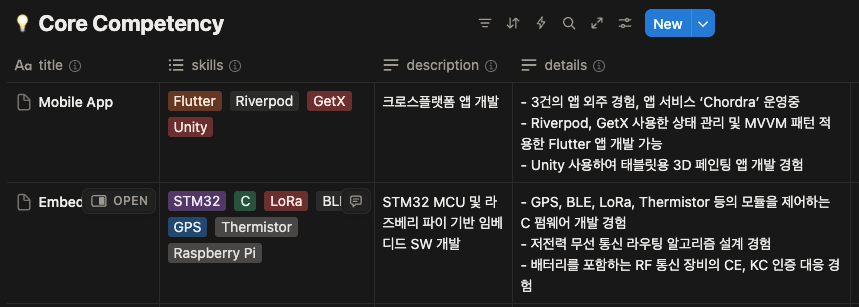
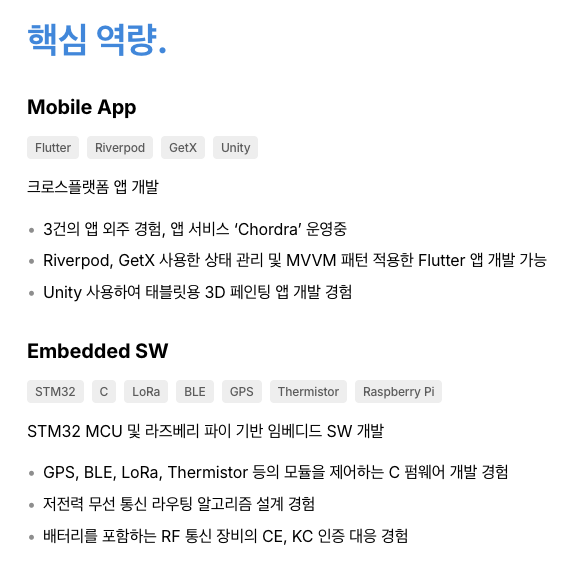
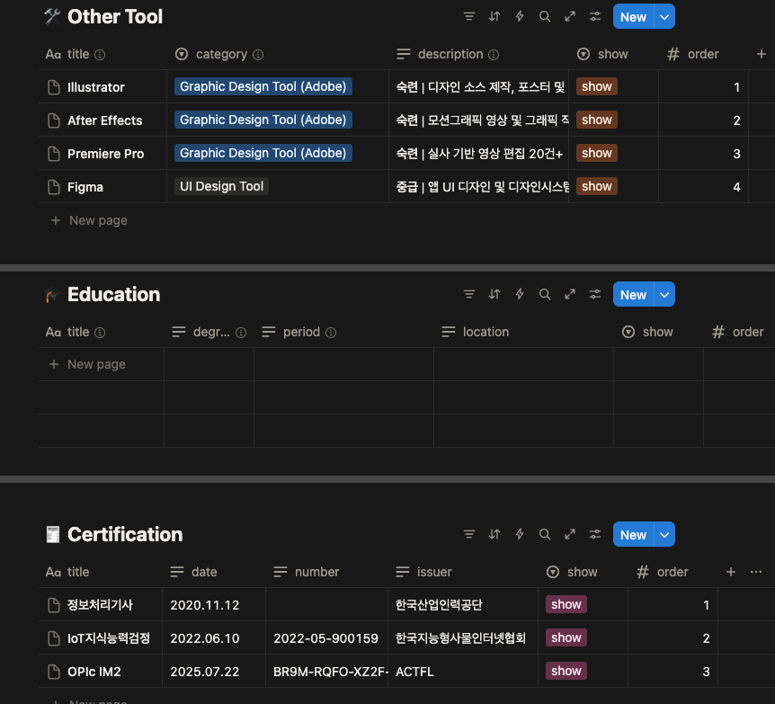
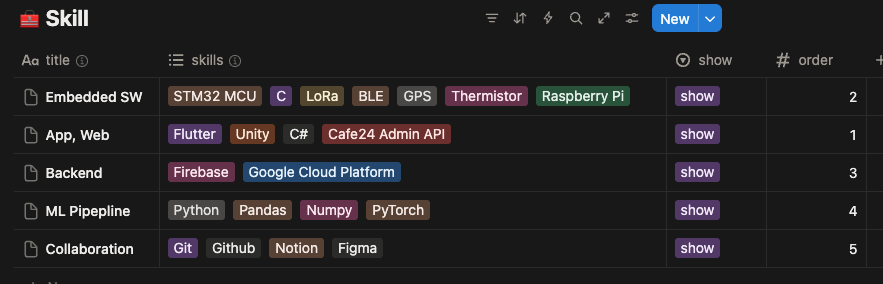
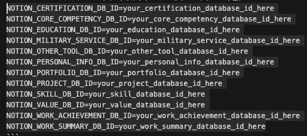
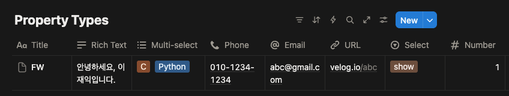

# Notion DB 연동 개발자 이력서 사이트

React와 Next.js로 구축된 공개 이력서 사이트입 템플릿입니다. 연동된 Notion 데이터베이스를 수정하면 이력서 페이지에 반영되도록 구현했습니다.

### Notion DB 및 이력서 사이트 예시

- [이재익 이력서 페이지](https://jaeikleedev.github.io/resume/)
- [이재익 이력서 Notion 데이터베이스](https://fluorescent-airplane-153.notion.site/Jaeik-Lee-Resume-Database-278b61feddfe80628aadf4982bcb492a)

## ✨ 주요 기능

- 🔄 **Notion API 연동**: Notion에서 이력서 내용을 수정하면 새로고침 시 반영
- 📱 **반응형 디자인**: 모바일과 데스크톱 최적화
- 👨‍💻 **개발자 최적화**: 기술 스택, 포트폴리오 등 개발자 이력에 최적화된 구성
- 👁️ **show/hide**: 원하는 섹션/프로퍼티만 show/hide 할 수 있는 기능
- 📄 **PDF 다운로드**: 이력서를 PDF로 다운로드 가능

## 🛠 기술 스택

- **Frontend**: Next.js 15, React 19, TypeScript
- **Styling**: Tailwind CSS, Custom CSS Variables
- **Fonts**: Pretendard (주요 폰트), JetBrains Mono (코드/기술 스택)
- **API Integration**: Notion API (@notionhq/client)
- **PDF Generation**: Puppeteer + @sparticuz/chromium
- **Deployment**: Vercel + GitHub Pages

## 📋 이력서 섹션 구성

**모든 섹션을 Notion에서 관리하고, 원하는 것만 보여줄 수 있습니다**

1. 개인 정보
2. 사용한 기술
3. 핵심 역량
4. 업무 경험
5. 프로젝트 경험
6. 포트폴리오
7. 가치관
8. 개발 외 툴 활용 역량
9. 학력
10. 자격증 및 어학
11. 병역

<br>

---

<br>

## 📋 Notion DB 구성하기

### 1. Notion Integration 생성하기

1. [Notion Developers](https://www.notion.so/my-integrations)에서 새 Integration 생성
   - Integration 이름 설정 (예: "Resume API")
   - Associated workspace: 본인 workspace
   - Type: Internal
2. Internal Integration Secret 복사해두기 - Notion 연동에 사용

### 2. Notion 데이터베이스 생성하기

[이재익 이력서 Notion Database](https://fluorescent-airplane-153.notion.site/Jaeik-Lee-Resume-Database-278b61feddfe80628aadf4982bcb492a)를 Duplicate 합니다.


duplicate as template 실패하는 경우가 많습니다. 다양한 브라우저, 시크릿 모드, 모바일에서 캐시 삭제 후 시도해보시길 바랍니다.

그래도 안 되는 경우, [이재익 이력서 Notion Database](https://fluorescent-airplane-153.notion.site/Jaeik-Lee-Resume-Database-278b61feddfe80628aadf4982bcb492a)와 아래 부록의 'Notion DB 구성' 참고해서 직접 구성해주시면 됩니다. 

> [!IMPORTANT]
> **각 property 이름은 소문자**로 해주세요. **notion.ts의 interface와 정확히 동일**해야 합니다.

### 3. 프로필 사진 설정하기

프로필 사진은 Notion DB가 아닌 **repo 내 정적 파일**로 관리됩니다:

1. **프로필 사진 준비**: `profile.jpg` 파일을 준비합니다 (권장 크기: 160x160px)
2. **파일 위치**: `public/images/profile.jpg`에 저장합니다
3. **파일 형식**: JPG, PNG, WebP 등 웹에서 지원하는 이미지 형식
4. **파일이 없는 경우**: 프로필 사진 섹션이 자동으로 숨겨집니다

### 4. Rich Text, Multi-select 필드의 데이터 입력 및 파싱 규칙

- **[Rich Text]** Bullet point: 줄 맨 앞에 '- ' (대시 + 공백) 입력
- **[Rich Text]** 줄바꿈: Notion에서 입력한 그대로 줄바꿈이 유지되어 표시
- **[Multi-select]** 각 항목을 개별 옵션으로 인식

#### 예시: skills 필드는 Multi-select, details필드는 Rich Text

**Notion DB 예시:**



**이력서 결과 페이지:**



### 5. 업무 경험 성과 나열하기

**여러 회사에서 근무한 경험이 있고, 각 회사별로 여러 성과를 보여주고 싶다면** 이렇게 구성하세요:

#### 회사별 기본 정보 입력 (Work Summary DB)
- 각 회사마다 하나의 레코드 생성
- 회사명, 직책, 근무기간, 회사 설명 등 입력

#### 성과별 상세 정보 입력 (Work Achievement DB)
- 각 성과마다 개별 레코드 생성
- **`company` 필드에 해당 성과가 속하는 회사명 입력(Work Summary DB의 `company` 필드와 동일)**

#### 예시

DB 구성


이력서 페이지


### 6. 사용하지 않는 섹션(DB)/프로퍼티

내용이 없는 데이터베이스/프로퍼티는 페이지에 표시하지 않도록 설계

#### 예시:

데이터베이스: 학력 DB 내용 X, 정보처리기사 'number' 프로퍼티 없음



페이지 결과: 학력 섹션 표시 안 됨. 정보처리기사 자격번호 표시하지 않음


### 7. DB의 각 row를 원하는 순서로 정렬하기

Notion Database API는 순서를 보장하지 않습니다. 모든 데이터베이스(Personal Info, Military Service 제외)에서 **order** 프로퍼티를 사용하여 표시 순서를 제어합니다:

- **order 1** → 맨 위에 표시
- **order 2** → 두 번째에 표시
- **order 3** → 세 번째에 표시
- **order 값이 없거나 잘못된 경우** → 맨 아래에 표시

**정렬 예시:**

Skill 데이터베이스:



웹사이트 화면


## 🚀 Getting Started
### 1. 템플릿 복사
- **Fork** 이 리포지토리를 fork 또는 클론하여 로컬 환경에 다운로드
- **의존성 설치**: `npm install`

### 2. Notion 설정
- Notion에서 이력서 데이터베이스 생성
- API 키 발급받기

### 3. 환경변수 설정
`.env.local` 파일을 생성하고 다음 환경변수들을 설정:
```env
# Notion API 설정
NOTION_TOKEN=your_notion_integration_token_here

# Notion Database IDs (각 데이터베이스 URL에서 32자리 ID 추출)
NOTION_CERTIFICATION_DB_ID=your_certification_database_id_here
NOTION_CORE_COMPETENCY_DB_ID=your_core_competency_database_id_here
NOTION_EDUCATION_DB_ID=your_education_database_id_here
NOTION_MILITARY_SERVICE_DB_ID=your_military_service_database_id_here
NOTION_OTHER_TOOL_DB_ID=your_other_tool_database_id_here
NOTION_PERSONAL_INFO_DB_ID=your_personal_info_database_id_here
NOTION_PORTFOLIO_DB_ID=your_portfolio_database_id_here
NOTION_PROJECT_DB_ID=your_project_database_id_here
NOTION_SKILL_DB_ID=your_skill_database_id_here
NOTION_VALUE_DB_ID=your_value_database_id_here
NOTION_WORK_ACHIEVEMENT_DB_ID=your_work_achievement_database_id_here
NOTION_WORK_SUMMARY_DB_ID=your_work_summary_database_id_here

# PDF 출력 페이지 URL (선택사항)
NEXT_PUBLIC_PDF_URL=https://your-resume-pdf.vercel.app/
```
각 ID는 다음과 같이 복사해옵니다.

#### NOTION_TOKEN

위의 '1. Notion Integration 생성 > 2.' 에서 복사한 Internal Integration Secret 입니다.

#### Notion Database IDs

각 데이터베이스의 세팅 > 'Manage data sources'


점 세개 메뉴 > 'Copy data source ID'


### 4. 실행하기
```bash
npm run dev
```
브라우저에서 `http://localhost:3000` 접속하면 이력서 페이지가 나타납니다!

**이제 Notion에서 내용을 수정한 후 웹사이트를 새로고침하면 반영됩니다** ✨

## 🌐 배포하기

**코드만 push하면 자동으로 배포됩니다!**

- **Vercel**: PDF 다운로드 기능, 새로고침 시 Notion 데이터 반영
- **GitHub Pages**: 정적 사이트, Notion 데이터 변경 시 수동 재배포 필요

## 🌐 Vercel 배포 가이드

### Vercel 배포 특징

- 🔄 **새로고침 반영**: Notion에서 수정 후 웹사이트 새로고침 시 반영
- 🚀 **자동 배포**: GitHub push 시 자동으로 배포
- 📄 **PDF 생성**: 이력서를 PDF로 다운로드 가능

### 1. Vercel 프로젝트 생성

1. [Vercel](https://vercel.com)에 접속하여 계정 생성
2. Add New Project
3. Continue with Github
4. Import Git Repository > Install > 내 계정 선택
5. Only select repositories > fork/클론한 리포지토리 선택
6. Import

### 3. 환경 변수 설정

'Environment Variables'를 열어 로컬의 .env.local 과 동일한 환경변수를 등록합니다. 또는 Deploy 후 Vercel 프로젝트 설정에서 **"Environment Variables"** 섹션에서도 추가할 수 있습니다.

> [!TIP]
> variable을 한번에 추가할 수 있습니다.
> 1. 아래와 같이 추가할 ID 전체를 선택, Copy합니다.
> 2. 'Key' 부분에 커서를 놓고 Paste합니다.




### 4. 배포 설정

1. **Framework Preset**: Next.js (자동 감지)
2. **Root Directory**: `./` (기본값)
3. **Build Command**: `npm run build` (기본값)
4. **Output Directory**: `.next` (기본값)

### 5. 배포 실행

1. **"Deploy"** 버튼 클릭
2. 배포 완료까지 2-3분 대기
3. 제공된 URL로 접속하여 확인

### 6. PDF 생성 기능을 위한 Vercel 설정

PDF 다운로드 기능이 정상 작동하려면 Vercel 설정을 조정해야 합니다:

1. **Vercel 대시보드** → 프로젝트 선택
2. **Settings** → **Deployment Protection**
3. **Vercel Authentication**: **Disabled**

> PDF 생성 시 Vercel 로그인 화면이 나타나는 문제를 해결하기 위해 필요합니다.
> 이력서 사이트는 공개 정보이므로 보안상 문제없습니다.

### 7. 업데이트 방식

#### **코드 변경 시 (자동 배포)**
- **GitHub Push**: 코드 수정 후 `git push` → Vercel 자동 배포

#### **Notion 데이터 변경 시 (새로고침)**
1. **Notion에서 이력서 내용 수정**
2. **Vercel 웹사이트에서 새로고침** (F5 또는 Ctrl+R)
3. **즉시 반영** → 변경된 내용 확인


### 8. 커스텀 도메인 설정 (선택사항)

1. Vercel 프로젝트 설정에서 **"Domains"** 섹션으로 이동
2. 원하는 도메인 입력
3. DNS 설정에 따라 도메인 연결

## 🌐 GitHub Pages 배포 가이드

### GitHub Pages 배포 특징

- 📄 **정적 사이트**: 정적 HTML/CSS/JS로 구성
- 🔄 **자동 배포**: GitHub Actions로 push 시 자동 배포
- 📝 **제한사항**: PDF 생성 기능 없음, Notion 데이터 변경 시 수동 재배포 필요

### 1. GitHub Pages 설정

1. **GitHub 리포지토리** → **Settings** → **Pages** 섹션으로 이동
2. **Source**: "GitHub Actions" 선택
3. 저장 후 자동으로 GitHub Actions 워크플로우가 실행됩니다

### 2. 환경 변수 설정

GitHub Pages는 정적 사이트이므로 Notion API를 사용할 수 없습니다. 대신 빌드 시점에 데이터를 가져와서 정적 파일로 생성합니다.

**GitHub Actions Secrets 설정:**
1. **GitHub 리포지토리** → **Settings** → **Secrets and variables** → **Actions**
2. **New repository secret** 클릭하여 로컬의 .env.local 과 동일한 환경변수를 등록

### 3. 자동 배포 확인

- **main 브랜치에 push**하면 자동으로 GitHub Actions가 실행됩니다
- **Actions 탭**에서 배포 진행 상황을 확인할 수 있습니다
- 배포 완료 후 `https://your-username.github.io/resume`에서 확인

### 4. GitHub Pages 업데이트 방식

#### **코드 변경 시 (자동 배포)**
- **GitHub Push**: 코드 수정 후 `git push` → GitHub Actions 자동 배포

#### **Notion 데이터 변경 시 (수동 재배포)**
1. **Notion에서 이력서 내용 수정**
2. **GitHub Actions** → **"Deploy to GitHub Pages"** 워크플로우 → **"Run workflow"** 클릭
3. **2-3분 후 완료** → GitHub Pages에 반영

### 5. GitHub Pages 제한사항

- **PDF 생성 기능 없음**: 정적 사이트이므로 서버리스 함수 사용 불가
- **실시간 API 연동 없음**: 빌드 시점에만 Notion 데이터 가져옴
- **Notion 데이터 변경 시 수동 재배포 필요**: GitHub Actions를 수동으로 실행해야 함

## 📄 PDF 다운로드

**웹사이트에서 바로 PDF 다운로드 버튼을 누르면 끝!**

- 웹사이트와 똑같은 PDF가 생성됩니다
- Notion에서 내용을 바꾸면 새로고침 후 PDF도 업데이트됩니다
- A4 크기로 인쇄하기 좋게 만들어집니다

## 🎨 부록 1: 타이포그래피 디자인 시스템

### 타이포그래피 클래스 목록

| 클래스명                 | 폰트 크기       | 폰트 웨이트 | 라인 높이 | 마진 하단 | 주 사용처                                                                                                   |
| ------------------------ | --------------- | ----------- | --------- | --------- | ----------------------------------------------------------------------------------------------------------- |
| `.text-hero`             | 2.5rem (40px)   | 800         | 1.2       | 2rem      | Personal Info > name                                                                                        |
| `.text-section-title`    | 2.25rem (36px)  | 700         | 1.2       | 2rem      | 모든 섹션 제목                                                                                              |
| `.text-subsection-title` | 1.625rem (26px) | 600         | 1.4       | 1rem      | • Project/Protfolio > title<br>• Work Summary > company/position                                            |
| `.text-details-title`    | 1.25rem (20px)  | 600         | 1.3       | 0.5rem    | • details-section의 제목<br>• 모든 DB의 title 필드<br>• Education > title+degree<br>• Other Tool > category |
| `.text-secondary-title`  | 1.125rem (18px) | 500         | 1.4       | 0.5rem    | • Personal Info > position<br>• Other Tool > title                                                          |
| `.text-body`             | 1rem (16px)     | 400         | 1.6       | 1rem      | • 모든 DB의 description 필드<br>• Personal Info > introduction<br>• 모든 details 필드                       |
| `.text-meta`             | 0.875rem (14px) | 400         | 1.4       | 1rem      | • 모든 DB의 period 필드<br>• Project > contribution<br>• Personal Info의 라벨 (Email., Phone. 등)           |
| `.text-contact`          | 0.9rem (14.4px) | 400         | 1.6       | 0         | • Personal Info > email/phone/blog/github (contact-row 내부)                                                |
| `.list-item`             | 1rem (16px)     | 400         | 1.6       | 0.375rem  | • 모든 details 필드 (BULLET_LIST)                                                                           |
| `.tech-chip`             | 0.75rem (12px)  | 400         | 1.4       | 0         | • 모든 DB의 skills 필드                                                                                     |

#### 컴포넌트 시스템

| 클래스명          | 스타일 속성     | 주 사용처                                            |
| ----------------- | --------------- | ---------------------------------------------------- |
| `.link`           | 링크 스타일     | 모든 외부 링크 (GitHub, Website, iOS, Android, Post) |
| `.list`           | 리스트 컨테이너 | bullet point 리스트 컨테이너                         |
| `.tech-container` | 플렉스 컨테이너 | 기술 스택 칩들을 감싸는 컨테이너                     |

#### 유틸리티 클래스

| 클래스명             | 스타일 속성                                   | 주 사용처                      |
| -------------------- | --------------------------------------------- | ------------------------------ |
| `.text-pre-line`     | white-space: pre-line                         | 줄바꿈이 포함된 텍스트         |
| `.margin-top-xxs`    | margin-top: 0.375rem                          | 최소 상단 마진                 |
| `.margin-top-sm`     | margin-top: 1rem                              | 중간 상단 마진                 |
| `.margin-bottom-xxs` | margin-bottom: 0.375rem                       | 최소 하단 마진                 |
| `.margin-bottom-lg`  | margin-bottom: 2rem                           | 큰 하단 마진                   |
| `.flex-between`      | display: flex, justify-content: space-between | 양쪽 정렬 플렉스 레이아웃      |
| `.center-section`    | text-align: center, border-top                | 센터 정렬된 섹션 (PDF 링크 등) |
| `.page-break-before` | page-break-before: always                     | PDF에서 페이지 브레이크        |

#### 레이아웃 시스템

| 클래스명                | 마진 하단 | 주 사용처                                     |
| ----------------------- | --------- | --------------------------------------------- |
| `.section`              | 6rem      | 모든 섹션 (Skill, Work Summary, Project 등)   |
| `.details-section`      | 1rem      | 섹션 내 개별 항목 (프로젝트, 학력, 자격증 등) |
| `.contact-container`    | -         | 연락처 정보 컨테이너 (프로필 사진 + 연락처)   |
| `.work-experience-item` | -         | 업무 경험 항목 (회사명 + 직책 + 설명)         |
| `.tech-container`       | -         | 기술 스택 칩들을 감싸는 플렉스 컨테이너       |

#### 폰트 패밀리

- **주요 폰트**: Pretendard (한글 최적화)
- **코드/기술 스택**: JetBrains Mono, SF Mono, Monaco, Cascadia Code, Roboto Mono, Consolas, Courier New
- **폴백**: -apple-system, BlinkMacSystemFont, 'Segoe UI', 'Roboto', 'Helvetica Neue', Arial, sans-serif

#### 색상 시스템

- **Primary**: #000000 (주요 텍스트)
- **Secondary**: #666666 (보조 텍스트)
- **Tertiary**: #999999 (메타 정보)
- **Accent**: #4A90E2 (섹션 제목)

#### 간격 시스템

- **XXS**: 0.375rem (6px) - 최소 간격
- **XS**: 0.5rem (8px) - 작은 간격
- **SM**: 1rem (16px) - 중간 간격
- **MD**: 1.5rem (24px) - 큰 간격
- **LG**: 2rem (32px) - 매우 큰 간격
- **XL**: 3rem (48px) - 섹션 간격
- **2XL**: 4rem (64px) - 주요 섹션 간격
- **3XL**: 6rem (96px) - 페이지 섹션 간격

#### 특별한 스타일링

- **Letter Spacing**: -0.01em ~ -0.03em (폰트 크기에 따라 조정)
- **Font Smoothing**: antialiased (macOS), grayscale (Windows)
- **Bullet Points**: CSS `::before` 가상 요소로 구현
- **Links**: 밑줄 스타일, hover 시 색상 변경 (`.link` 클래스)
- **Tech Chips**: 둥근 모서리, 배경색, 패딩 적용
- **Contact Links**: 밑줄 없음, hover 시 색상 변경 (`.text-contact.link`)
- **Pre-line Text**: 줄바꿈 보존 (`.text-pre-line` 클래스)
- **Responsive Design**: 모바일에서 Work Experience position 중복 방지

#### CSS 구조 개선

- **논리적 그룹화**: CSS Variables → Base Styles → Typography → Layout → Components → Responsive → PDF Mode
- **위계순 정렬**: 타이포그래피 클래스들을 위계에 따라 정렬
- **인라인 스타일 최소화**: 자주 사용되는 스타일을 CSS 클래스로 추출
- **유틸리티 클래스**: 마진, 플렉스 레이아웃 등 재사용 가능한 유틸리티 제공

## 부록 2: Notion DB 구성

### Notion property

> [!NOTE] Notion 프로퍼티 타입은 프로퍼티 이름 앞 아이콘으로 구별할 수 있습니다.



### Notion 이력서 데이터베이스 구성

#### Personal Info 데이터베이스

| 프로퍼티명   | 프로퍼티 타입 | 타이포그래피 클래스     | 설명              |
| ------------ | ------------- | ----------------------- | ----------------- |
| name         | Title         | `.text-hero`            | 이름 (메인 제목)  |
| position     | Rich Text     | `.text-secondary-title` | 직책/포지션       |
| email        | Email         | `.text-contact`         | 이메일 (연락처)   |
| phone        | Phone Number  | `.text-contact`         | 전화번호 (연락처) |
| location     | Rich Text     | `.text-meta`            | 위치 (메타 정보)  |
| introduction | Rich Text     | `.text-body`            | 짧은 소개 (본문)  |
| blog         | URL           | `.text-contact`         | 블로그 (링크)     |
| github       | URL           | `.text-contact`         | 깃허브 (링크)     |

> **프로필 사진**: Notion DB가 아닌 `public/images/profile.jpg` 파일로 관리됩니다. 해당 파일이 있으면 표시되고, 없으면 프로필 사진 섹션이 숨겨집니다.

#### Skill 데이터베이스

| 프로퍼티명 | 프로퍼티 타입 | 타이포그래피 클래스 | 설명                             |
| ---------- | ------------- | ------------------- | -------------------------------- |
| title      | Title         | -                   | 카테고리 분류 (화면에 표시 안됨) |
| skills     | Multi-select  | `.tech-chip`        | 기술 스택 (칩 형태)              |
| order      | Number        | -                   | 정렬 순서 (1이 맨 위)            |
| show       | Select        | -                   | 표시 여부                        |

#### Core Competency 데이터베이스

| 프로퍼티명  | 프로퍼티 타입 | 타이포그래피 클래스         | 설명                             |
| ----------- | ------------- | --------------------------- | -------------------------------- |
| title       | Title         | `.text-details-title`       | 제목                             |
| description | Rich Text     | `.text-body`                | 설명                             |
| skills      | Multi-select  | `.tech-chip`                | 관련 기술 스택                   |
| details     | Rich Text     | `.text-body` / `.list-item` | 사례, bullet point 설명 (조건부) |
| order       | Number        | -                           | 정렬 순서                        |
| show        | Select        | -                           | 표시 여부                        |

#### Work Summary 데이터베이스

| 프로퍼티명  | 프로퍼티 타입 | 타이포그래피 클래스      | 설명      |
| ----------- | ------------- | ------------------------ | --------- |
| company     | Title         | `.text-subsection-title` | 회사명    |
| position    | Rich Text     | `.text-subsection-title` | 직책      |
| period      | Rich Text     | `.text-meta`             | 근무 기간 |
| description | Rich Text     | `.text-body`             | 회사 설명 |
| order       | Number        | -                        | 정렬 순서 |
| show        | Select        | -                        | 표시 여부 |

#### Work Achievement 데이터베이스

| 프로퍼티명 | 프로퍼티 타입 | 타이포그래피 클래스         | 설명                                  |
| ---------- | ------------- | --------------------------- | ------------------------------------- |
| title      | Title         | `.text-details-title`       | 성과 소제목                           |
| details    | Rich Text     | `.text-body` / `.list-item` | 성과 디테일 (조건부)                  |
| skills     | Multi-select  | `.tech-chip`                | 해당 성과 관련 기술 스택              |
| company    | Rich Text     | -                           | Work Summary DB > 'company'와 같은 값 |
| order      | Number        | -                           | 정렬 순서                             |
| show       | Select        | -                           | 표시 여부                             |

#### Project 데이터베이스

| 프로퍼티명   | 프로퍼티 타입 | 타이포그래피 클래스         | 설명                      |
| ------------ | ------------- | --------------------------- | ------------------------- |
| title        | Title         | `.text-subsection-title`    | 프로젝트 제목             |
| description  | Rich Text     | `.text-body`                | 프로젝트 설명             |
| period       | Rich Text     | `.text-meta`                | 개발 기간                 |
| skills       | Multi-select  | `.tech-chip`                | 사용한 기술 스택          |
| details      | Rich Text     | `.text-body` / `.list-item` | 성과 상세 (조건부)        |
| contribution | Rich Text     | `.text-meta`                | 기여도 정보               |
| github       | URL           | `.link`                     | GitHub 저장소 링크        |
| website      | URL           | `.link`                     | 웹사이트 링크             |
| ios          | URL           | `.link`                     | iOS 앱스토어 링크         |
| android      | URL           | `.link`                     | Android 플레이스토어 링크 |
| post         | URL           | `.link`                     | 블로그 글 링크            |
| order        | Number        | -                           | 정렬 순서                 |
| show         | Select        | -                           | 표시 여부                 |

#### Portfolio 데이터베이스

| 프로퍼티명   | 프로퍼티 타입 | 타이포그래피 클래스         | 설명                      |
| ------------ | ------------- | --------------------------- | ------------------------- |
| title        | Title         | `.text-subsection-title`    | 포트폴리오 제목           |
| description  | Rich Text     | `.text-body`                | 포트폴리오 설명           |
| period       | Rich Text     | `.text-meta`                | 개발 기간                 |
| skills       | Multi-select  | `.tech-chip`                | 사용한 기술 스택          |
| details      | Rich Text     | `.text-body` / `.list-item` | 주요 기능들 (조건부)      |
| github       | URL           | `.link`                     | GitHub 저장소 링크        |
| website      | URL           | `.link`                     | 웹사이트 링크             |
| ios          | URL           | `.link`                     | iOS 앱스토어 링크         |
| android      | URL           | `.link`                     | Android 플레이스토어 링크 |
| post         | URL           | `.link`                     | 블로그 글 링크            |
| contribution | Rich Text     | `.text-meta`                | 기여도 정보               |
| order        | Number        | -                           | 정렬 순서                 |
| show         | Select        | -                           | 표시 여부                 |

#### Value 데이터베이스

| 프로퍼티명 | 프로퍼티 타입 | 타이포그래피 클래스         | 설명               |
| ---------- | ------------- | --------------------------- | ------------------ |
| title      | Title         | `.text-details-title`       | 가치관 제목        |
| details    | Rich Text     | `.text-body` / `.list-item` | 상세 내용 (조건부) |
| order      | Number        | -                           | 정렬 순서          |
| show       | Select        | -                           | 표시 여부          |

#### Other Tool 데이터베이스

| 프로퍼티명  | 프로퍼티 타입 | 타이포그래피 클래스     | 설명                           |
| ----------- | ------------- | ----------------------- | ------------------------------ |
| title       | Title         | `.text-secondary-title` | 도구명 (카테고리 내 개별 도구) |
| category    | Select        | `.text-details-title`   | 카테고리 (섹션 제목)           |
| description | Rich Text     | `.text-body`            | 숙련도 및 경험 설명            |
| order       | Number        | -                       | 정렬 순서                      |
| show        | Select        | -                       | 표시 여부                      |

#### Education 데이터베이스

| 프로퍼티명 | 프로퍼티 타입 | 타이포그래피 클래스   | 설명                                      |
| ---------- | ------------- | --------------------- | ----------------------------------------- |
| title      | Title         | `.text-details-title` | 학교명 + 학위/전공 (하나의 제목으로 결합) |
| degree     | Rich Text     | -                     | title과 함께 표시됨                       |
| period     | Rich Text     | `.text-meta`          | 학력 기간                                 |
| location   | Rich Text     | `.text-meta`          | 위치                                      |
| order      | Number        | -                     | 정렬 순서                                 |
| show       | Select        | -                     | 표시 여부                                 |

#### Certification 데이터베이스

| 프로퍼티명 | 프로퍼티 타입 | 타이포그래피 클래스   | 설명               |
| ---------- | ------------- | --------------------- | ------------------ |
| title      | Title         | `.text-details-title` | 자격증명           |
| date       | Rich Text     | `.text-meta`          | 취득일             | 자격증 번호 | 발행기관 (하나의 메타 정보로 결합) |
| number     | Rich Text     | -                     | date와 함께 표시됨 |
| issuer     | Rich Text     | -                     | date와 함께 표시됨 |
| order      | Number        | -                     | 정렬 순서          |
| show       | Select        | -                     | 표시 여부          |

#### Military Service 데이터베이스

| 프로퍼티명 | 프로퍼티 타입 | 타이포그래피 클래스   | 설명      |
| ---------- | ------------- | --------------------- | --------- |
| title      | Title         | `.text-details-title` | 병역 정보 |
| period     | Rich Text     | `.text-meta`          | 복무기간  |
